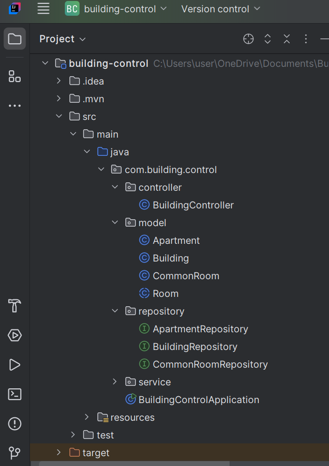

## Building-Control(Backend) – Spring Boot
   - A backend system designed for temperature-controlled building automation.
   - It manages apartments, common rooms, heating/cooling logic, and serves JSON APIs for a modern control dashboard.
### Features
### Room System
- Each room (apartment or common room) includes:
    - unique ID
    - Random temperature (between 10°C – 40°C)
    - Heating and cooling auto-evaluation
    - Heating ON → if room temp below requested temperature
    - Cooling ON → if room temp above requested temperature

### Apartments
- Inherits all room features
- Additional:
    - Apartment Number
    - Owner Name

### Common Room
- Supported types:
    -  `Gym`,`Library` or `Laundry`

### Building
- Can contain 0 or more apartments
- Can contain 0 or more common rooms
- Has a requested temperature (Default = 20°C)
- API support for:
    - Updating requested temperature
    - Adding apartments
    - Adding common rooms
    - Getting full building status

### Tech Stack
  - Java 17
  - Spring Boot 3
  - Spring Web
  - Spring Data JPA
  - Hibernate ORM
  - MySQL Database 
  - Maven

### Project Structure
   - 

### API Endpoints
 - Create Initial Building
      - Creates:
          - Apartment 101
          - Apartment 102 
          - Gym 
          - Library 
          - Requested Temperature = 25°C
            
### Get Building by ID
     - /api/building/{id}
### Update Requested Temperature
      - /api/building/{id}/temperature?newTemperature=26
### Add Apartment
      - /api/building/{id}/add-apartment
### Add Common Room
      - /api/building/{id}/add-common-room
### Database 
       - MySql
      
