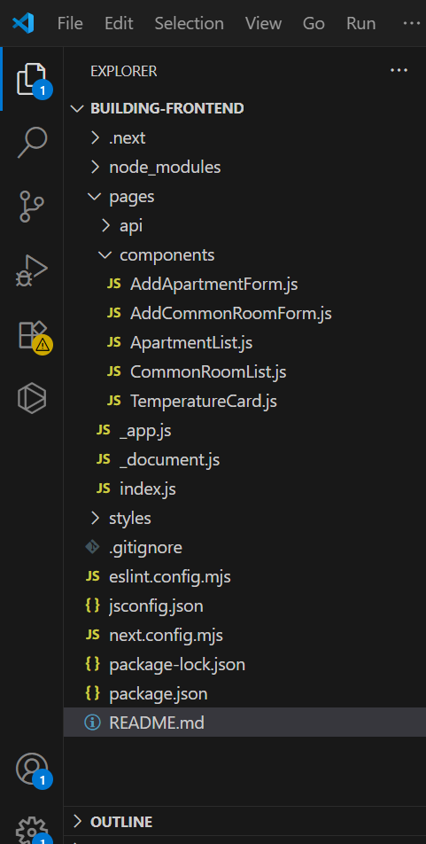
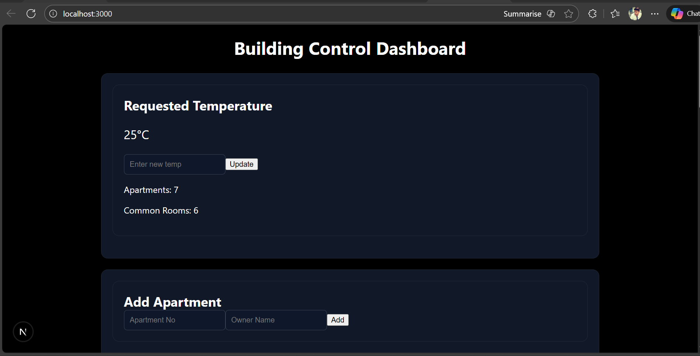

## Building Control Dashboard – Frontend (Next.js)
   - A modern and responsive Next.js + React frontend application for managing a smart building’s.
   - This UI interacts with the backend (Spring Boot REST APIs) and provides a clean dashboard.
 
### Features
   - View building temperature
   - Add apartments
   - Add common rooms (Gym / Library / Laundry)
   - Check heating & cooling status
   - Display real-time room temperatures

### Room System
- Each room (apartment or common room) includes:
    - unique ID
    - Random temperature (between 10°C – 40°C)
    - Heating and cooling auto-evaluation
    - Heating ON → if room temp below requested temperature
    - Cooling ON → if room temp above requested temperature

### Tech Stack
  - Next.js 16
  - React.js
  - CSS Modules / Inline Styles
  - Fetch API

### Project Structure
   - 

### API Endpoints
   - Load Building Data
   - Update Requested Temperature
   - Add Apartment
   - Add Common Room
            
### UI Features
   - Clean Dashboard
   - Add New Apartments
   - Add Common Rooms
   - Status Indicators
   - Responsive UI

### Run This Project Locally
    - Install Dependencies npm install
    - Start Development Server Start Development Server

### How Frontend Works (Flow)
   - User opens dashboard → index.js loads
   - useEffect() calls backend → fetch building data
   - Components receive building info as props
   - User actions (Add Apartment / Update Temp / Add Room) send API requests
   - After success → UI auto-refreshes  

### Frontend UI
  - 